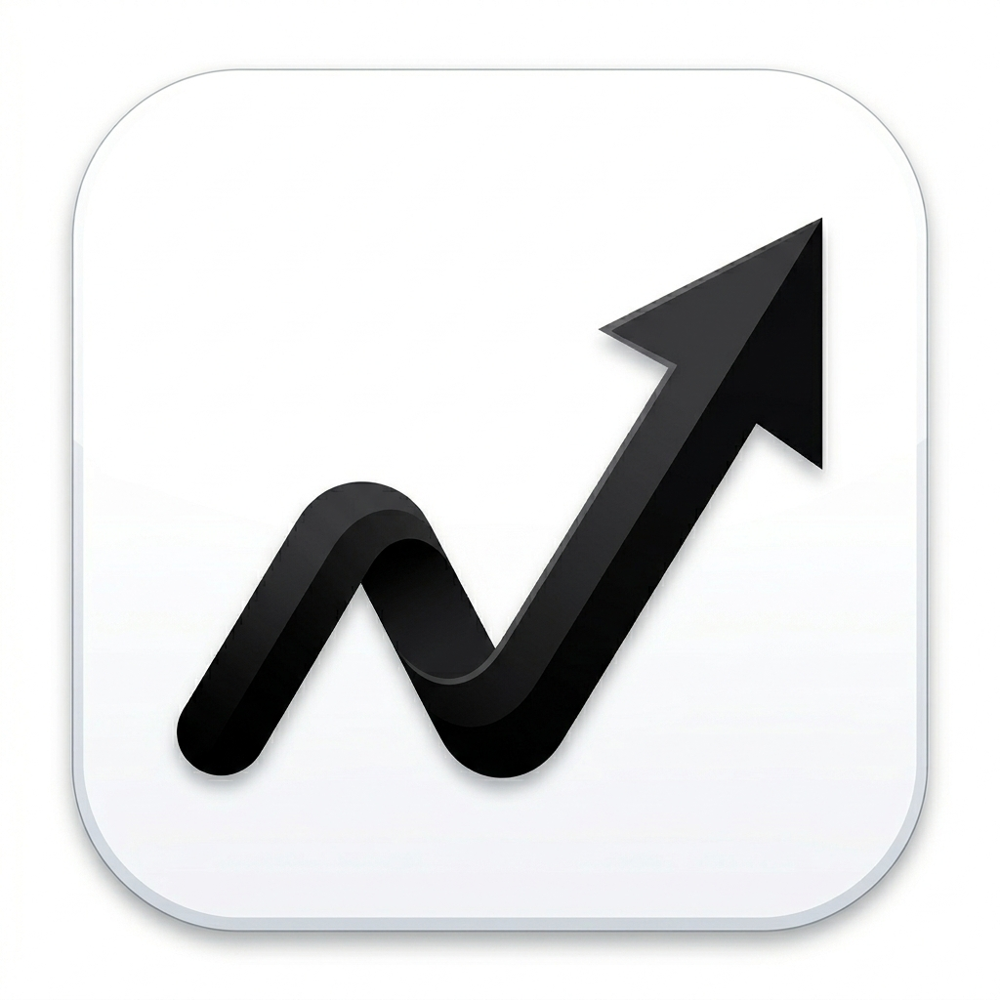

<div align="center">
  

  <h1>Vexa Finance</h1>

  <p><strong>Premium personal finance management — track smarter, live better.</strong></p>

  <p>
    
    
    
    
    
  </p>
</div>

---

## Overview

Vexa Finance is a cross-platform mobile and web application built with Flutter, designed to give users a clear and beautiful view of their financial life. From daily spending to long-term goals, Vexa brings all your finances into one premium experience.

## Screenshots

<!-- Add screenshots here once the UI is finalized -->
> Coming soon

## Features

### Core
- **Home Dashboard** — real-time balance, spending breakdown, AI-powered insights, and transaction feed
- **Wallet** — categorized expense management with custom categories
- **Subscriptions** — all recurring payments tracked automatically
- **Budget** — monthly budget caps per category with progress indicators

### Planning & Growth
- **Financial Goals** — set targets with deadlines and track progress visually
- **Financial Calendar** — monthly view of all income and expense events
- **Analysis** — charts and trends to understand spending patterns

### Engagement
- **Health Score** — composite score of your financial wellness
- **Gamification** — daily streaks and achievement badges to reinforce good habits
- **Education** — curated daily financial tips

### Profile
- Multi-currency support
- Data export utilities
- Custom notifications
- Security settings

## Architecture

```
lib/
├── app.dart                    # Root widget
├── main.dart                   # Entry point
├── core/
│   ├── constants/              # Spacing, curves
│   ├── providers/              # Global state (settings)
│   ├── router/                 # Navigation & transitions
│   └── theme/                  # Colors, typography, theme
├── features/
│   ├── home/                   # Dashboard, transactions
│   ├── wallet/                 # Categories & wallet view
│   ├── subscriptions/          # Recurring payments
│   ├── budget/                 # Monthly budgeting
│   ├── goals/                  # Financial goals
│   ├── health/                 # Health score
│   ├── analysis/               # Charts & analytics
│   ├── calendar/               # Financial calendar
│   ├── gamification/           # Streaks & achievements
│   ├── education/              # Daily tips
│   ├── profile/                # User settings & profile
│   ├── onboarding/             # First-launch flow
│   └── splash/                 # Splash screen
└── shared/
    └── widgets/                # Reusable UI components
```

**State management:** Riverpod  
**Pattern:** Feature-first, with domain / presentation separation per feature

## Tech Stack

| Package | Purpose |
|---|---|
| `flutter_riverpod` | State management |
| `fl_chart` | Charts and graphs |
| `google_fonts` | Typography |
| `intl` | Internationalization & number formatting |
| `flutter_launcher_icons` | App icon generation |
| `flutter_native_splash` | Splash screen |

## Getting Started

### Prerequisites

- [Flutter SDK](https://docs.flutter.dev/get-started/install) `^3.12.0`
- Dart `^3.12.0`
- Android Studio / Xcode (for device targets)

### Installation

```bash
# Clone the repository
git clone https://github.com/tu-usuario/vexa-finance.git
cd vexa_finance

# Install dependencies
flutter pub get

# Run on a connected device or emulator
flutter run
```

### Useful Commands

```bash
flutter analyze          # Lint and static analysis
flutter test             # Run test suite
flutter build apk        # Android APK
flutter build ios        # iOS (requires macOS + Xcode)
flutter build web        # Web
flutter build windows    # Windows desktop
flutter build macos      # macOS desktop
flutter build linux      # Linux desktop
```

## Contributing

Contributions are welcome! Please follow these steps:

1. Fork the repository
2. Create a feature branch: `git checkout -b feat/your-feature`
3. Commit your changes using [Conventional Commits](https://www.conventionalcommits.org/)
4. Push and open a Pull Request

Please run `flutter analyze` and `flutter test` before submitting.

## Roadmap

- [ ] Backend integration & real data sync
- [ ] Push notifications
- [ ] Dark / light theme toggle
- [ ] Biometric authentication
- [ ] CSV / PDF export
- [ ] Localization (ES / EN)
- [ ] Widget support (Android & iOS)

## License

This project is licensed under the MIT License — see the [LICENSE](LICENSE) file for details.

---

<div align="center">
  Made with Flutter by <strong>Alvarez</strong>
</div>
